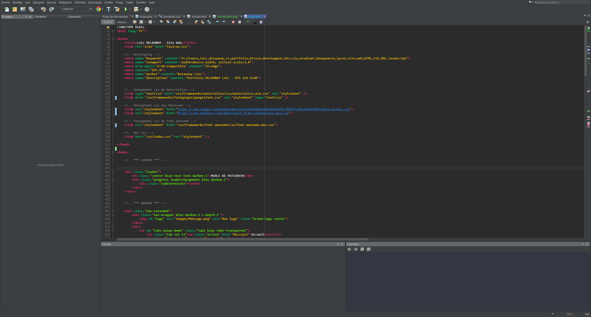

Netbeans_Theme

Créateur original : Thomas Faure 

Modification sur le thème : Moi 

Vous en avez marre de l'interface de NetBeans ? Mais vous ne pouvez pas vous en passer ? Voici le thème qu'il vous faudras !

Pour l'installer:

- Ouvrir netbeans
- Outils - Options
- Importer 

et voilà !!!

*Si vous avez des idées d'améliorations merci de laisser un commentaire :) 

