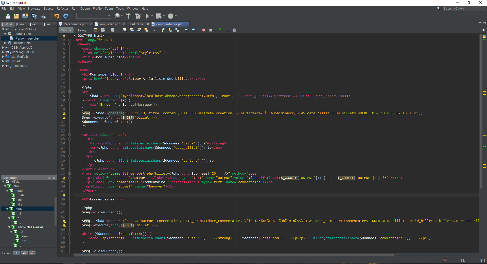

NetBeans_Reborn

Créateur original : Thomas Laure 

Modification sur le thème : Moi 

Vous en avez marre de l'interface de NetBeans ? Mais vous ne pouvez pas vous en passer ? Voici le thème qu'il vous faudra !

Pour l'installer :

- Ouvrir NetBeans
- Tools / Options
- Font and colors
- Import...

et voilà !!!

*Si vous avez des idées d'améliorations merci de laisser un commentaire :) 

Lien de téléchargement sur le site de NetBeans : http://plugins.netbeans.org/plugin/73121/?show=true

