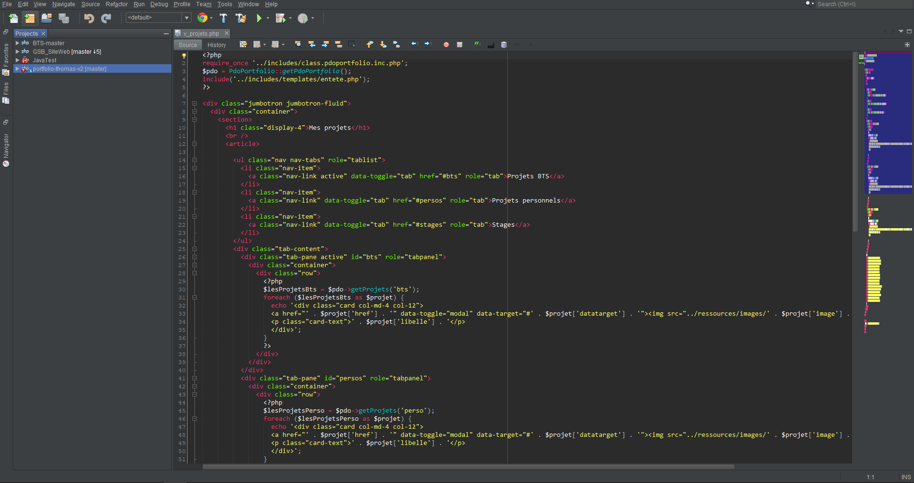

# NetBeans Reborn

Créateur original : Thomas Laure 
Modification sur le thème : Loïc Delaunay

Thème inspiré de Sublime Text et de Visual Studio.

Pour l'installer :

- Ouvrir NetBeans
- Tools / Options
- Fonts & colors
- Import...

*Si vous avez des idées d'améliorations merci de laisser un commentaire :) 

Lien de téléchargement sur le site de NetBeans : http://plugins.netbeans.org/plugin/73121/?show=true

